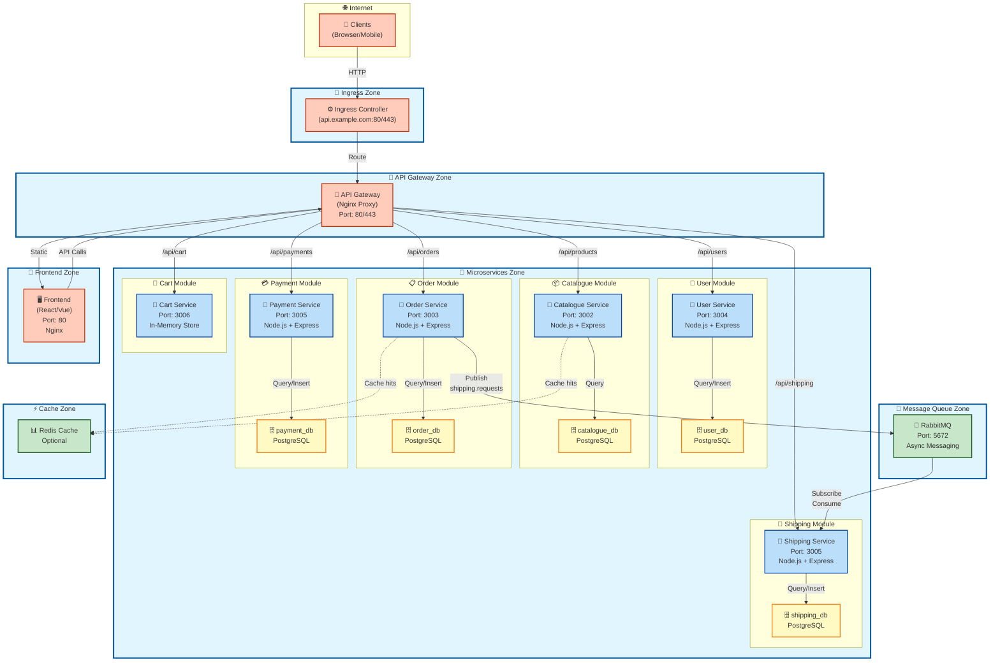
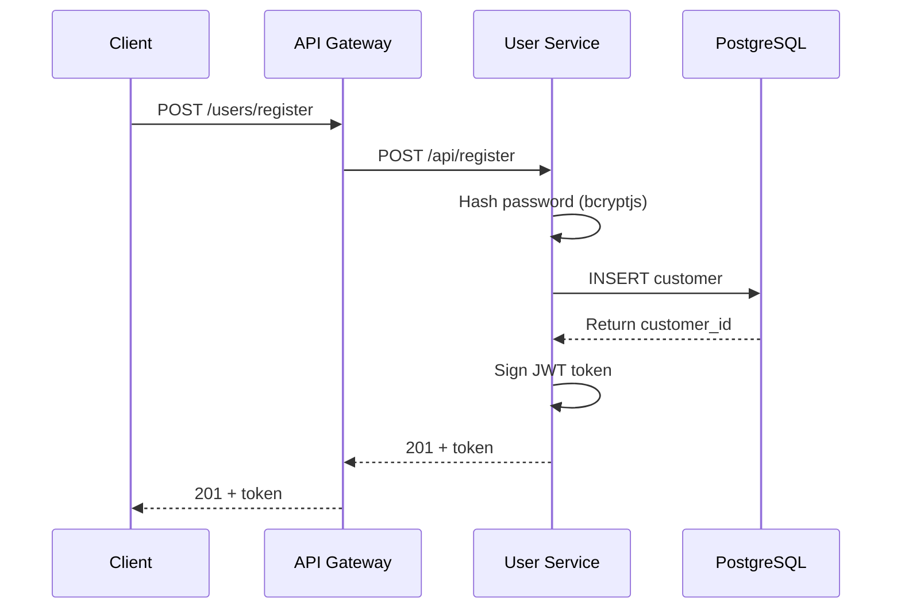
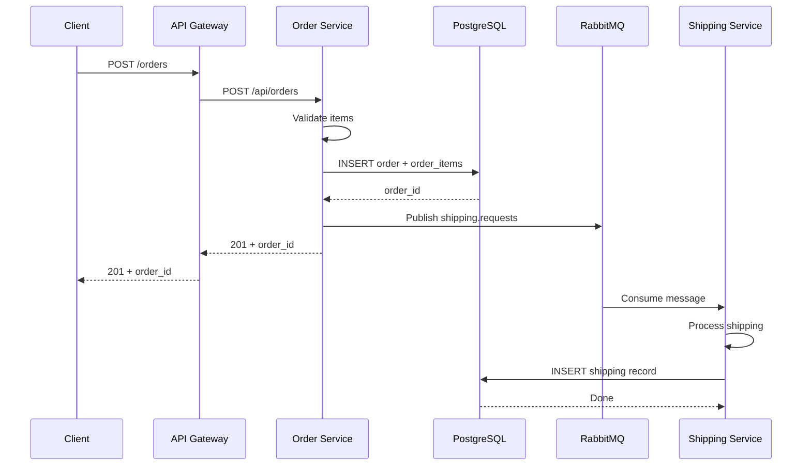
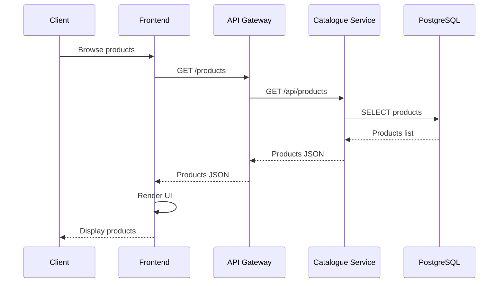
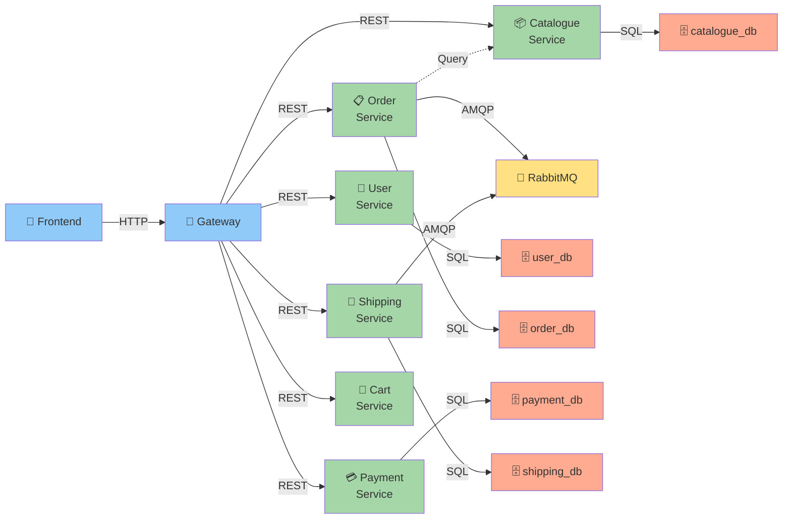
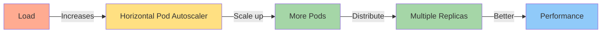

# 🏗️ Detailed Architecture Diagram

## Microservice E-Commerce Architecture



---

## 🔄 Data Flow Patterns

### Pattern 1: User Registration & Login



### Pattern 2: Order Processing with Async Shipping



### Pattern 3: Product Catalog Browse



---

## 📊 Deployment Zones

```
┌─────────────────────────────────────────────────────────────┐
│                    KUBERNETES CLUSTER                        │
│  ┌──────────────────────────────────────────────────────┐   │
│  │                  INGRESS ZONE                        │   │
│  │  • Ingress Controller (api.example.com)              │   │
│  │  • SSL/TLS Termination                               │   │
│  └───────────────────────┬────────────────────────────┐ │   │
│                          │                            │ │   │
│  ┌──────────────────────────────────────────────────┐ │ │   │
│  │          API GATEWAY ZONE (Nginx)                │ │ │   │
│  │  • Route requests to services                    │ │ │   │
│  │  • Rate limiting (future)                        │ │ │   │
│  │  • Request logging                               │ │ │   │
│  └──────────────────────────────────────────────────┘ │ │   │
│         │         │         │       │       │         │ │   │
│  ┌──────┴─────────┴─────────┴───────┴───────┴────┐    │ │   │
│  │        MICROSERVICES ZONE                    │    │ │   │
│  │  ┌──────────┐  ┌──────────┐  ┌──────────┐  │    │ │   │
│  │  │  User    │  │Catalogue │  │  Order   │  │    │ │   │
│  │  │ Service  │  │ Service  │  │ Service  │  │    │ │   │
│  │  └────┬─────┘  └────┬─────┘  └────┬─────┘  │    │ │   │
│  │       │             │             │        │    │ │   │
│  │  ┌──────────┐  ┌──────────┐  ┌──────────┐  │    │ │   │
│  │  │ Payment  │  │Shipping  │  │  Cart    │  │    │ │   │
│  │  │ Service  │  │ Service  │  │ Service  │  │    │ │   │
│  │  └──────────┘  └──────────┘  └──────────┘  │    │ │   │
│  └──────────────────────────────────────────────┘    │ │   │
│         │                                             │ │   │
│  ┌──────┴──────────────────────────────────────┐     │ │   │
│  │      DATABASE ZONE (PostgreSQL)             │     │ │   │
│  │  • user_db (separate PVC)                   │     │ │   │
│  │  • catalogue_db (separate PVC)              │     │ │   │
│  │  • order_db (separate PVC)                  │     │ │   │
│  │  • payment_db (separate PVC)                │     │ │   │
│  │  • shipping_db (separate PVC)               │     │ │   │
│  └──────────────────────────────────────────────┘    │ │   │
│         │                                             │ │   │
│  ┌──────┴──────────────────────────────────────┐     │ │   │
│  │    MESSAGE QUEUE ZONE (RabbitMQ)            │     │ │   │
│  │  • shipping.requests queue                  │     │ │   │
│  │  • order.events (future)                    │     │ │   │
│  └──────────────────────────────────────────────┘    │ │   │
│                                                      │ │   │
│  ┌──────────────────────────────────────────────┐   │ │   │
│  │     FRONTEND ZONE (Static + Nginx)           │   │ │   │
│  │  • React/Vue application                     │   │ │   │
│  │  • Port 80 (external)                        │   │ │   │
│  └──────────────────────────────────────────────┘   │ │   │
└─────────────────────────────────────────────────────┘ │   │
└────────────────────────────────────────────────────────┘
```

---

## 🔍 Service Dependencies



---

## ⚙️ Technology Stack

| Layer | Technology | Port | Purpose |
|-------|-----------|------|---------|
| **Load Balancer** | Ingress (K8s) | 80/443 | Entry point, SSL termination |
| **API Gateway** | Nginx | 80/443 | Service routing, reverse proxy |
| **Frontend** | Nginx (React/Vue) | 80 | Static content delivery |
| **Services** | Node.js + Express | 3002-3006 | Business logic |
| **Databases** | PostgreSQL 14 | 5432 | Persistent data storage |
| **Message Queue** | RabbitMQ | 5672 | Async messaging |
| **Orchestration** | Kubernetes | - | Container orchestration |
| **Container Runtime** | Docker | - | Containerization |

---

## 📈 Scalability



---

## 🔐 Security Layers

```
Client Request
    ↓
[SSL/TLS Termination at Ingress]
    ↓
[Ingress Authentication/Authorization]
    ↓
[API Gateway Rate Limiting]
    ↓
[Service-level JWT Validation]
    ↓
[Database Query Validation]
    ↓
Secure Response
```

---

## 📝 Notes

- **Database per Service**: Each microservice has its own PostgreSQL database
- **Async Communication**: Order → Shipping via RabbitMQ (eventual consistency)
- **API Gateway**: Single entry point for all client requests
- **Load Balancing**: K8s handles pod-level load balancing
- **Health Checks**: Each service has `/health` endpoint for K8s probes
- **Logging**: Centralized logging (future: ELK Stack)
- **Monitoring**: Prometheus + Grafana (future)

---

*Generated: January 2026 | Microservice E-Commerce Platform*
